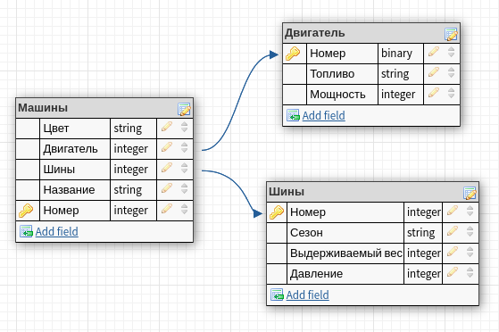

# Начинаем работать с postgresql.

#### Введение
PostgreSQL позиционируют себя, как самую продвинутую базу с открытым исходным кодом в мире. 
Почему люди выбирают именно PostgreSQL среди множества аналогов:
- Типы данных: огромное количество поддерживаемых типов данных — и геометрические, и UUID, и сетевые адреса, и денежные, и перечисляемые. Список поддерживаемых типов данных у PostgreSQL один из самых больших. При этом есть возможность создать собственный тип данных.
- Соответствие требованиям ACID, ссылочная и транзакционная целостность и множество механизмов для поддержания целостности данных.
- Виртуальные таблицы, функциональные индексы и многое другое.

PostgreSQL — это продвинутая и профессиональная система управления базами данных. Тем не менее, она довольно старая и не может учитывать новых тенденций. Несмотря на это, PostgreSQL надёжна, и вы уверенно можете использовать её в проекте любой сложности. 


#### Развёртывание и установка

Компьютерная СУБД — это программа, взаимодействие с которой осуществляется по сети. Проще говоря, сервер. Сервер СУБД отвечает за хранение, выдачу данных, а также администрирование. Он не инициирует действия, а лишь выполняет команды, передаваемые по специальному протоколу. Но где сервер — там и клиент. Именно клиент отправляет команды серверу. Причём клиенты бывают разных типов:
- Терминальный клиент — ждёт от пользователя ввода команды и перенаправляет напрямую в СУБД, а затем печатает ответ. В этом случае инициатор всех манипуляций с данными — пользователь.
- Веб-интерфейс — приложение, позволяющее отправлять запросы и получать информацию о СУБД через HTTP.
- Клиентская программа — выполняет свою задачу и автоматически формирует запросы к БД.
В этом уроке вы попробуете установить, настроить и запустить и сервер, и клиент.

#### Установка PostgreSQL
Можно пойти по простому пути и установить PostgreSQL одной командой:
```bash
apt install postgresql postgresql-contrib 
```
Не факт что будет установлена самая свежая версия, но нам непринципиально.

Установка добавляет в систему новый сервис с названием **postgresql** — программу, которая выполняется фоново. За её работоспособностью следит система. Этот сервис представляет собой непосредственно сам сервер СУБД. Для работы с сервисами в Debian есть две команды:
- ```systemctl``` — доступна не во всех дистрибутивах, но имеет широкие возможности,
- ```service``` — доступна во многих дистрибутивах Linux, но имеет меньше возможностей.

```bash
systemctl enable postgresql
systemctl start postgresql
systemctl status postgresql
```

Можно узнать на каком порту работает postgresql.
Для этого есть команды ```ss``` или ```netstat``` флаги одинаковые: ```-tulpn```.

#### Подключение к СУБД

Взаимодействовать с данными напрямую через сервис нельзя. Понадобится клиент. Мы будем использовать консольный клиент psql, который подключится к серверу по сети через указанный выше порт.

Чтобы сделать любую операцию в СУБД, нужно авторизоваться в ней. Для этого в PostgreSQL есть своя база данных, содержащая пользователей, их пароли и права. Имеет значение также, от какого пользователя системы производится запуск самой команды ```psql```. Если сделать это от имени пользователя **postgres**, который был добавлен в систему при установке PostgreSQL, вы будете авторизованы автоматически. Причём с самыми широкими правами — правами администратора СУБД.

В Debian можно запускать команды от имени других пользователей через **sudo**. По умолчанию оно запускает команду от имени **root**. Но можно указать другого пользователя, добавив параметр ```-u```. Нас интересует пользователь **postgres**:
```bash
sudo -u postgres psql
```
Таким образом, любой пользователь из списка **sudoers** имеет полный контроль над всей базой данных. Это влечёт определённый риск. Ниже будет показано, как установить пароль пользователю **postgres**.
После выполнения команды должно открыться интерактивное консольное приложение, выглядящее так:
```bash
postgres=#
```
Попробуйте следующие служебные команды:
- ```\conninfo``` — выводит информацию о соединении,
- ```\du``` — выводит список пользователей, известных СУБД и их роли,
- ```exit``` или ```\q``` — завершает сессию.

PostgreSQL, как и другие электронные СУБД, имеет иерархическую структуру. Верхний элемент иерархии — база данных. СУБД может управлять несколькими базами данных. Для каждой можно создать своего пользователя-администратора и настроить права других пользователей. Если несколько независимых приложений работают с СУБД, для каждого нужно создать отдельную базу данных и правильно настроить доступы. В базах данных хранятся таблицы.

Остальные команды можно глянуть через ```\h```.

## Реляционные базы данных
Итак, СУБД оперирует базами данных, базы данных оперируют логически связанными таблицами. Таблицы состоят из строк и столбцов. В PostgreSQL таблица имеет фиксированное число столбцов, которое задаётся при её создании. А строки могут многократно добавляться и удаляться. Другое название строк — записи. Они соответствуют хранимым в таблице объектам. Другое название столбцов — свойства.

То, что столбцы задаются при создании таблицы, не значит, что их нельзя потом менять. Но делать это нужно аккуратно, потому что такое изменение обычно связано с изменением модели данных программы.

Подобный способ организации данных в виде таблиц называется **реляционная база данных**.
Например, если мы хотим создать базу данных машин, надо задать себе несколько вопросов.

Например, если мы хотим создать базу данных машин, надо задать себе несколько вопросов.

- Какие данные о машинах нужно хранить? Например, машина может иметь цвет, двигатель, шины и, конечно, название.
- Что мы знаем о шинах? Шины бывают зимние, летние и демисезонные. Они могут отличаться выдерживаемым весом и рекомендованным давлением внутри.
- Что мы знаем о двигателях? Они работают на бензине, дизеле и ещё бывают гибридными. У них бывает разная мощность.
- Как эти сущности связаны между собой? У каждой машины бывают шины и двигатель, а также цвет.

Мы можем выделить такие таблицы:

- таблица двигателей, со следующими столбцами:
- - поддерживаемый вид топлива,
- - мощность.
- таблица шин, со следующими столбцами:
- - сезонность,
- - выдерживаемый вес,
- - рекомендованное давление.
- таблица машин, со следующими столбцами:
- - двигатель,
- - комплект шин,
- - цвет,
- - название.

Среди свойств машины мы выделили в отдельную таблицу двигатель и шины, но не выделили цвет и название. Эти столбцы задаются скалярным значением, нет смысла создавать для них отдельную таблицу.

Определив таблицы с наборами столбцов и логическими связями между ними, мы уже проектируем реляционную базу данных.

Чтобы запись одной таблицы могла ссылаться на запись другой таблицы, подобно тому как машина ссылается на двигатель и комплект шин, используется индекс, или первичный ключ. Это специальный уникальный номер, который присваивается каждой строке таблицы.

Таким образом, таблица с машинами может ссылаться на конкретный тип двигателя просто храня индекс нужной строчки таблицы двигателя. А индекс строчки таблицы шин определит тип шин этой машины.

Вот пример базы данных, построенной по этому принципу:
| Индекс | Название | Двигатель | Цвет | Шины |
|---|---|---|---|---|
| 0 | Запорожец | 0 | Красный | 0 |
| 1 | Лада | 10 | Синий | 1 |

| Индекс | Топливо | Мощность |
|---|---|---|
| 0 | бензин | 164 |
| 10 | дизельное | 128 |

| Индекс | Сезон |
|---|---|
| 0 | зимние |
| 1 | всесезонные |

Базы данных проектируют при помощи специальных программ. Бывает полезен, например, сервис **DbDesigner.net**. Вот пример базы данных, спроектированной в этом сервисе:

Такой способ организации данных оказывается очень удобен при работе с ООП. Каждой таблице при этом можно сопоставить класс, а каждой строке — объект класса.

## Нормальные формы

Чтобы разобраться с тем, как лучше структурировать базу данных, познакомимся с термином **«функциональная зависимость»**:
```
Говорят, что между двумя наборами столбцов есть функциональная зависимость,
если значения второго набора можно однозначно определить по значениям первого.
```

Одна из проблем, присущих плохо спроектированным базам — **дублирование** данных, или **избыточность**. Оно, помимо того, что потребляет дисковое пространство, может привести к неприятной ситуации — **неконсистентности**. В этой ситуации есть два противоречащих друг другу источника одной и той же информации. Какому из них больше верить — неясно.

В теории реляционных баз данных описывается методология, позволяющая достичь оптимальной структуры, то есть минимизировать дублирование данных и количество функциональных зависимостей. Для этого разработаны ограничения на таблицы — нормальные формы.

Обычно выделяют не менее пяти нормальных форм. Полный список в [Википедии](https://ru.wikipedia.org/wiki/Нормальная_форма#Нормальные_формы).

#### Нормальная форма №1
Первая нормальная форма (1НФ) накладывает на таблицы два ограничения:
- Все столбцы содержат только простые скалярные значения, но не массивы и не перечисления.
- Нет повторяющихся строк.

Например, в нашем примере с машинами, таблица могла бы выглядеть так:

| Название | Двигатель |
|---|---|
| Запорожец | бензиновый |
| Лада | бензиновый, дизельный |

В таком случае она бы не соответствовала нормальной форме, поскольку столбец «Двигатель» содержит в себе перечисление, то есть не является простым скалярным значением.

| Название | Двигатель |
|---|---|
| Запорожец | бензиновый |
| Лада | бензиновый |
| Лада | дизельный |


#### Нормальная форма №2

Вторая нормальная форма добавляет к первой новые ограничения. Чтобы сформулировать её требования, понадобятся дополнительные понятия. 

```
Составной ключ — это несколько столбцов таблицы, 
формирующих уникальную для таблицы последовательность значений.
```

Иными словами, это такой набор столбцов, что если оставить только эти столбцы, в таблице всё равно не будет повторяющихся строк.

Если в таблице задан составной ключ, можно говорить о неключевых столбцах — тех, которые не входят в составной ключ.

В этом случае каждая строка таблицы определяется значениями столбцов составного ключа. А значит, есть функциональная зависимость каждого неключевого столбца от составного ключа.

Вторая нормальная форма (2НФ) накладывает на таблицы такие ограничения:
- Ограничения 1НФ.
- Каждый неключевой столбец функционально зависит от всего составного ключа, а не его частей.
  
Например, таблица могла бы выглядеть так:
| Название | Двигатель | Мощность | Объём бака |
|---|---|---|---|
| Запорожец | бензиновый | 164 | 32 литра |
| Лада | бензиновый	| 164 | 38 литров |
| Лада | дизельный | 128 | 36 литров |

Можно заметить, что в этом примере составным ключом будет «Название» и «Двигатель». «Объём бака» уникален для каждого составного ключа, но «Мощность» зависит только от «Двигателя», но не от «Названия». Таким образом, это первая нормальная форма, но не вторая нормальная форма.

Можно нормализовать эти данные. Получим две таблицы.

Первая:
| Название | Двигатель | Объем бака |
|---|---|---|
| Запорожец | бензиновый | 32 литра |
| Лада | бензиновый | 38 литров |
| Лада | дизельный | 36 литров |

Вторая:
| Двигатель | Мощность | 
|---|---|
| бензиновый  | 164 |
| дизельный | 128 |

#### Нормальная форма №3

Таблица находится в третьей нормальной форме, если она находится во второй нормальной форме, и среди ее подмножества неключевых атрибутов тоже нельзя выделить функциональную зависимость.

| Название | Двигатель | Мощность |
|---|---|---|
| Запорожец | бензиновый | 164 |
| Лада | бензиновый | 164 |
| ЗИЛ | дизельный | 128 |

В такой таблице первичным ключом служит первый столбец. Условие 2НФ автоматически выполнено. Но 3НФ она не соответствует, потому что очевидно между двигателем и его мощностью есть функциональная зависимость.
Нормализируем данные:
| Название | Двигатель |
|---|---|
| Запорожец | бензиновый |
| Лада | бензиновый |
| ЗИЛ | дизельный |

Вторая таблица:
| Двигатель | Мощность |
|---|---|
| бензиновый | 164 |
| дизельный | 128 |

По идее представление о нормальных формах и о том, как правильно проектировать базы данных уже есть. Значит пора приступать к взаимодействию с СУБД.

## Язык SQL

Обмен информацией с СУБД происходит через запросы. Клиент посылает запрос — сервер отвечает. Запросы — текстовые. Ответ, как правило, содержит таблицу. Запросы пишутся на специальном языке [SQL](пояснение "от англ. structured query language — «структурированный язык запросов»"). Он позволяет читать данные, модифицировать их и администрировать СУБД. Фактически всё, что можно сделать с PostgreSQL, за исключением запуска и остановки сервиса, доступно через SQL.

SQL появился почти одновременно с реляционными базами данных. СУБД, поддерживающих этот язык, немало. Они называются SQL-подобными, а все остальные — [NoSQL](пояснение "от англ. not only SQL — «не только SQL»"). В отличие от SQL-подобных баз, которые оперируют таблицами, NoSQL чаще всего оперируют документами. Однако существует множество различных вариантов.

Теоретически SQL — это универсальный интерфейс взаимодействия с реляционными базами данных, поскольку одни и те же запросы должны оставаться валидными для любой базы данных, поддерживающей этот язык.

Но язык быстро развивался и развивается, и помимо базовых запросов, которые мы рассмотрим в этом уроке, оброс множеством дополнительных функций, превративших его в подобие полноценного языка программирования. Обратной стороной такого развития стало то, что сегодня разные СУБД поддерживают разные диалекты этого языка и, скорее всего, написанное для одной СУБД не будет работать в другой без небольшой (а в некоторых случаях серьёзной) доработки.

Мы будем рассматривать диалект SQL, поддерживаемый PostgreSQL.

#### Создание базы данных

Как говорилось выше, СУБД оперирует базами данных. Каждая база данных имеет определённую цель, например, обслуживание конкретного приложения, и позволяет независимо настраивать права пользователей.

В psql можно вводить два типа запросов:
- Метакоманды, которые приводились ранее; начинаются со слэша.
- SQL-код.

Например, метакоманда ```\l``` (от англ. list — «список») в psql позволит увидеть перечень баз данных.

Чтобы создать новую базу данных, воспользуемся SQL-запросом:
```sql
CREATE DATABASE trest_base;
```
Ключевые слова в SQL принято писать большими буквами, а названия столбцов, таблиц, переменных, функций и баз данных — маленькими. Каждая SQL-команда заканчивается точкой с запятой.

Теперь, если снова ввести ```\l``` , мы увидим созданную базу

Параметры команды **CREATE DATABASE** не исчерпываются названием БД. Полную документацию на английском языке можно найти в [официальной документации PostgreSQL](https://www.postgresql.org/docs/current/sql-createdatabase.html).

#### Удаление базы данных

Чтобы удалить созданную базу данных, вбейте SQL-команду:
```sql
DROP DATABASE trest_base;
```
Убедимся в успехе командой ```\l```. Мы увидим, что базы данных снова нет в списке существующих баз данных нашей СУБД.
Полную документацию по команде удаления базы данных в PostgreSQL можно найти [здесь](https://www.postgresql.org/docs/15/sql-dropdatabase.html).

#### Вычисления и литералы
Когда вы работаете в терминале операционной системы, вы находитесь в текущей директории. Все файлы по умолчанию ищутся в этой директории. Текущую директорию можно сменить.

Аналогично обстоит дело и в СУБД, только вместо директории выступает база данных. Всегда есть текущая база данных, но в любой момент вы можете подключиться к другой (если у вас достаточно прав). Отличие от директорий в том, что БД не могут быть вложены.

По умолчанию вы подключены к БД postgres. Убедиться в этом можно командой:

```sql
SELECT current_database();
```

**SELECT** — универсальная команда. Одно из её предназначений — вычисление. В данном случае мы вычислили значение встроенной функции ```current_database()```. В результате должна получиться таблица, состоящая из одного столбца с названием ```current_database```.

Используя SELECT, можно вычислять значения произвольных выражений:
К примеру:
```sql
SELECT (2 * 32) / 4; 
SELECT length('МАН, Я ОБОЖАЮ POSTGRESQL');
```
Можно работать с числами с плавающей точкой или со строками. Строки записываются в одинарных кавычках.
В них работает экранирование. Поместить в строку кавычку можно, удвоив её: ```'User''s name'``` задаёт строку ```User's name```. Привычное экранирование работает, если предварить литерал буквой E:
```sql
> SELECT E'Hello, \'Postgres\'!\nHello, user!';
      ?column?
--------------------
 Hello, 'Postgres'!+
 Hello, user!
(1 row)
```
В данном случае + в таблице означает переход содержимого на следующую строку.
